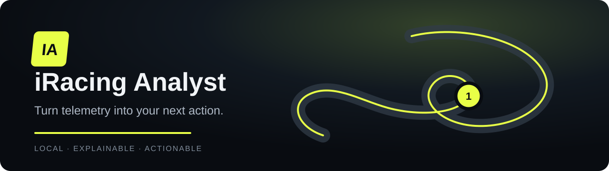
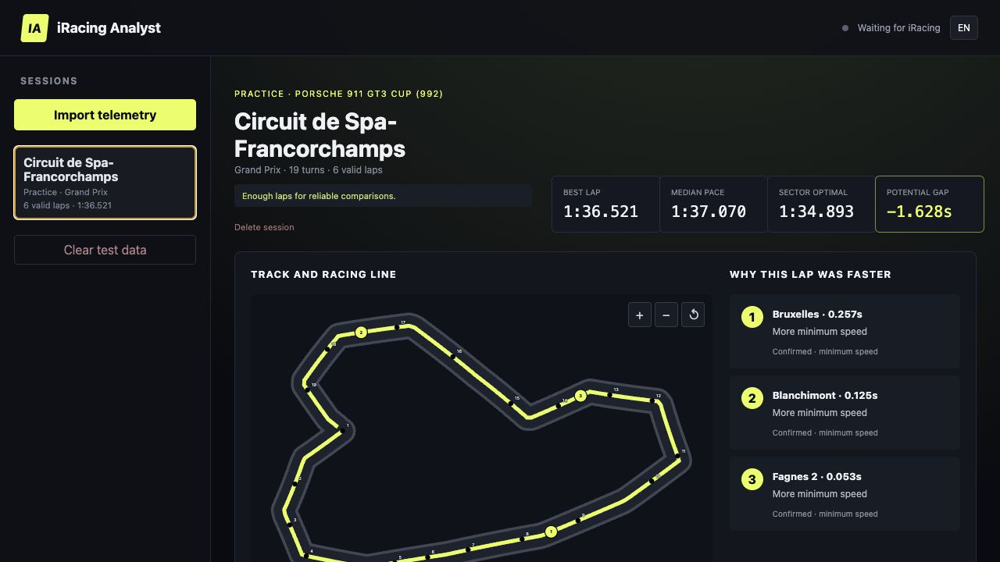
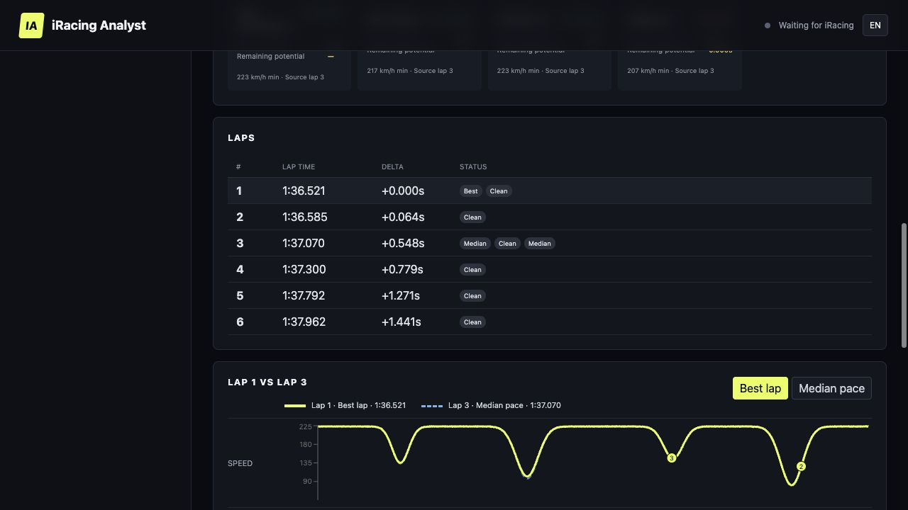
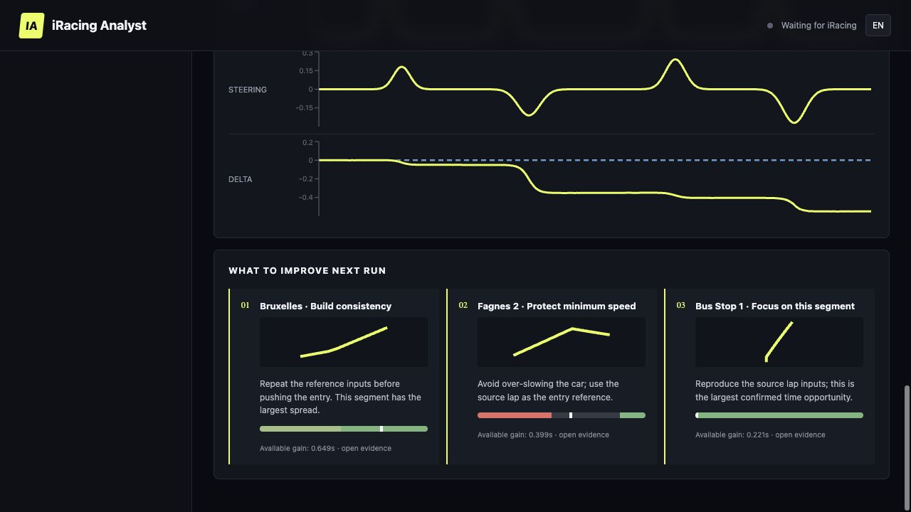

<p align="center">
  
</p>

<p align="center">
  <a href="docs/README.ru.md">Русская версия</a> ·
  <a href="https://github.com/supsailor/iracing-analyst/releases/latest">Download for Windows</a> ·
  <a href="CHANGELOG.md">Changelog</a>
</p>

# Turn telemetry into your next action

iRacing Analyst is a local-first lap analysis app for iRacing and Le Mans Ultimate. It compares your best lap with your typical pace, shows where the difference was made, and turns telemetry into a short, measurable plan for the next run.

No account. No cloud upload. No subscription. Your telemetry stays on your PC.

## What you get

- **Best vs Median** — understand what actually changed on your fastest lap.
- **Actionable coaching** — get up to three measurable priorities instead of generic advice.
- **Evidence you can inspect** — verify every insight on the track map, racing line and synchronized speed, throttle, brake, steering and delta charts.
- **Your achievable potential** — Sector Optimal is built from segments you have already driven.
- **Session clarity** — inspect clean laps, incidents, out laps, in laps and incomplete laps.
- **Automatic capture** — start the portable app before driving in iRacing or LMU.
- **Offline analysis** — import an iRacing `.ibt` or native LMU `.duckdb` recording.

## See the lap, understand the difference

### Find where the time came from



The report connects ranked insights to the same corner on the map, corner cards and telemetry charts.

### Compare laps and driving inputs



Switch between Best and Median, select any valid lap, and inspect braking, minimum speed, throttle application, exit speed and steering corrections.

### Leave with a plan



Recommendations show the expected opportunity, the relevant corner and the brake–apex–throttle phases to reproduce.

> Screenshots use anonymous deterministic demonstration data.

## Install in three steps

1. Open the [latest release](https://github.com/supsailor/iracing-analyst/releases/latest) and download `iracing-analyst-v0.2.1-windows-x64.zip`.
2. Extract the archive to a folder you can keep. Do not run the executable from inside the ZIP.
3. Start `iracing-analyst.exe`, then launch your simulator and drive. The report opens locally in your browser.

For iRacing, no additional setup is required. To analyze an older session, enable disk telemetry with `Alt+L` and import the resulting `.ibt`.

### Le Mans Ultimate setup

LMU live capture is currently available for testing on the `codex/lmu-support` branch and is not part of the public v0.2.1 release yet.

1. In LMU, open `Settings → Gameplay`.
2. Turn on `Enable Plugins`, then restart LMU.
3. Start iRacing Analyst before entering the track. Practice, Qualifying, Warmup and Race are captured automatically through LMU's built-in shared memory interface.

For an older LMU session, enable `Automatic Telemetry Recording` in LMU and import the `.duckdb` file from `Le Mans Ultimate\UserData\Telemetry`. The original file is never modified.

See LMU's official [shared-memory update notes](https://guide.lemansultimate.com/hc/en-gb/articles/14556121957775-V1-2-Update-2) and [telemetry recording guide](https://guide.lemansultimate.com/hc/en-gb/articles/14524956311695-Telemetry-Recording).

### Windows security notice

The MVP executable is not code-signed, so Microsoft Defender SmartScreen may show an unknown-publisher warning. Only run builds downloaded from this repository's Releases page and verify the published SHA-256 checksum.

## Simulator support

| Capability | iRacing | Le Mans Ultimate |
| --- | --- | --- |
| Automatic live capture | Local SDK | Built-in Shared Memory |
| Offline import | `.ibt` | `.duckdb` |
| Best / Median / Sector Optimal | Yes | Yes |
| Track map and racing line | Yes | Yes, from world coordinates |
| Pedal and steering comparison | Yes | Yes |
| Incident labels | iRacing `1x/2x/4x` | Invalid-lap status only |
| Curated corner catalog | Spa | Automatic zones during testing |

## Supported platform

- Windows 10/11 x64.
- Road layouts and the local player's telemetry.
- Separate session reports with multiple stints.
- Curated Spa corner names; unknown layouts use automatically detected zones.
- English and Russian interface.

## MVP boundaries

- Oval, dirt and rain-specific coaching are not included yet.
- Other drivers, replay analysis, setup advice, cloud sync and live coaching are out of scope.
- Sector Optimal combines the best valid semantic segments; it is not a physically stitched micro-optimal lap.
- Coaching is deterministic and omitted when the evidence is weak.

## Privacy

All session data is processed and stored locally in the application data directory. The runtime does not use simulator web APIs, OAuth, an LLM, analytics or any cloud service.

## Development

Requirements: Python 3.11+ and Node.js 20+.

```bash
python -m venv .venv
.venv/Scripts/pip install -e "backend[dev]"
cd frontend && npm ci && npm run build
cd .. && python scripts/copy_frontend.py
iracing-analyst
```

Generate anonymous demo telemetry without iRacing:

```bash
iracing-analyst generate-demo data/spa-demo.npz
iracing-analyst analyze data/spa-demo.npz
```

See [THIRD_PARTY_NOTICES.md](THIRD_PARTY_NOTICES.md) for runtime dependencies.

## License and trademark notice

Released under the [MIT License](LICENSE).

iRacing is a trademark of iRacing.com Motorsport Simulations, LLC. Le Mans Ultimate is a trademark of its respective owners. This independent project is not affiliated with, endorsed by, or sponsored by either simulator or its publishers.
